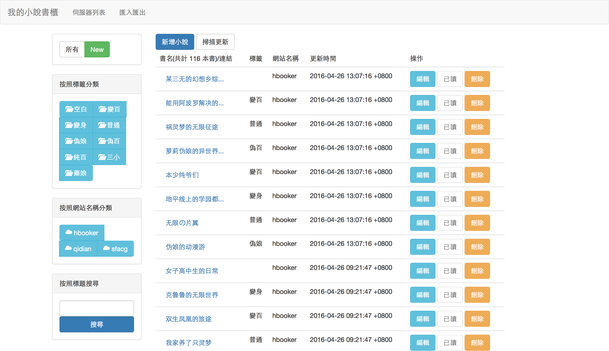

# 完成功能

* 自動掃描 : 完成網站有
    
    - 起點
    - hbooker

* 匯入匯出
    
    - 匯入：json型
    - 匯出：txt型、json型

# 畫面



# 啟動

```bash
$ bin/delayed_job run
$ bin/rails s
```
# README

This README would normally document whatever steps are necessary to get the
application up and running.

Things you may want to cover:

* Ruby version

* System dependencies

* Configuration

* Database creation

* Database initialization

* How to run the test suite

* Services (job queues, cache servers, search engines, etc.)

* Deployment instructions

* ...

